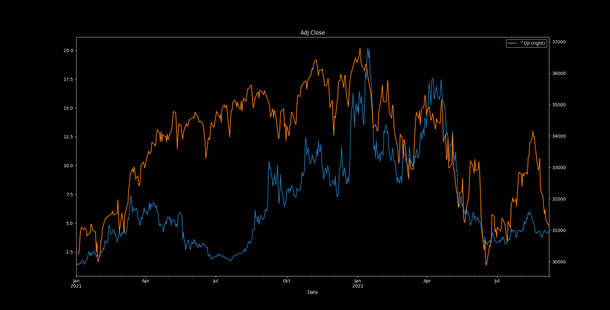
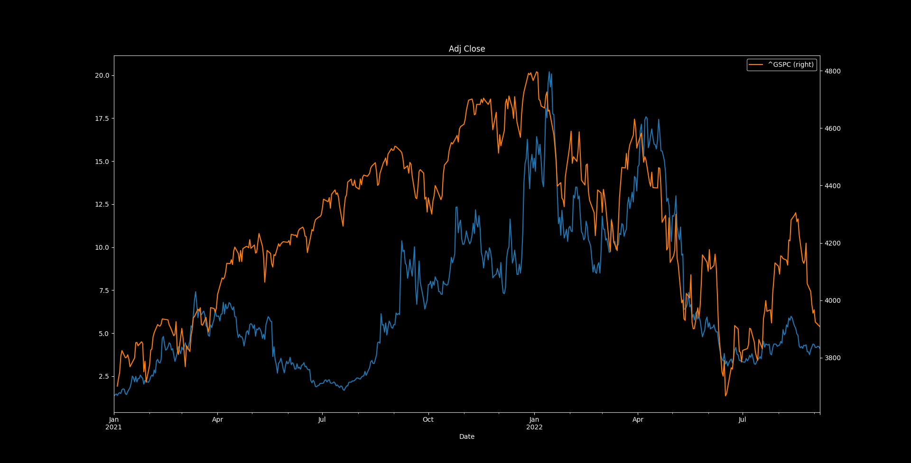
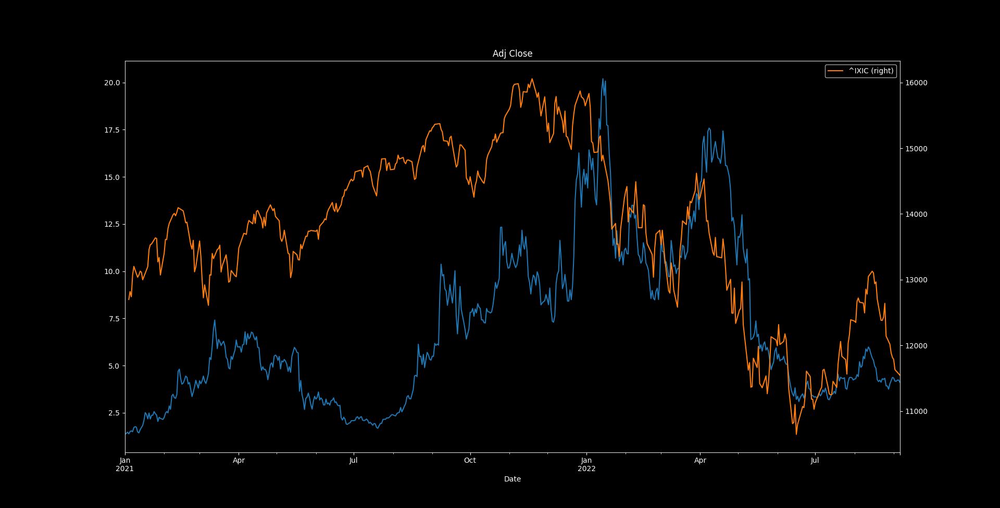

# Near Data Science Challenge

This is a comparison of the price of NEAR versus the price of the stock market. Specifically we will be examining the 
DOW Jones index (DJI), the NASDAQ index (IDIX), and the S&P 500 index (GSPC). 

# Dow Jones Vs NEAR

# S&P Versus NEAR

# NASDAQ Versus NEAR

The following code was used to generate these graphs: 

<pre>
class StockCompare:
    def __init__(self):
        self.rc_params = {
            "lines.color": "white",
            "patch.edgecolor": "white",
            "text.color": "white",
            "axes.facecolor": "black",
            "axes.edgecolor": "lightgray",
            "axes.labelcolor": "white",
            "xtick.color": "white",
            "ytick.color": "white",
            "grid.color": "grey",
            "figure.facecolor": "black",
            "figure.edgecolor": "black",
            "figure.figsize": "25, 12"}

    def compare_price(self, symbol_a='NEAR-USD', symbol_b='^IXIC',
             start: datetime.datetime = datetime.datetime(2021, 1, 1),
             end: datetime.datetime = datetime.datetime.now()):
        """
        Compare two stocks
        :param symbol_a: first ticker
        :param symbol_b: second ticker
        :param start: since when (defaults to 1/1/2021)
        :param end: until when (default is now)
        :return: None
        """
        plt.rcParams.update(self.rc_params)
        plt.figure()
        #start = datetime.datetime(2021, 1, 1)
        #end = datetime.datetime.now()
        prices = web.get_data_yahoo(symbol_a, start, end)
        idix = web.get_data_yahoo(symbol_b, start, end)
        prices['Adj Close'].plot(label=symbol_a, title='Adj Close');
        idix['Adj Close'].plot(label=symbol_b, title='Adj Close', secondary_y=True);
        plt.legend();
        plt.show()
        plt.savefig(fname=f'figures/{symbol_a}_{symbol_b}_{time.time()}.png')

api = StockCompare()
# compare with nasdaq
api.compare_price('NEAR-USD', '^IXIC')
# compare with dow 30
api.compare_price('NEAR-USD', '^DJI')
# compare with s&p 500
api.compare_price('NEAR-USD', '^GSPC')
</pre>

# Analysis 

As you can see, the price of NEAR seems to follow the stock market very closely. There is a close correlation 
between the NEAR/USD market and all of these indexes.

This is useful because the value of an asset is arguably its most important characteristic. This is something that is 
worth paying attention to because when the stock market is not doing well or is predicted to crash (this happens to be 
the case now), it is likely that some people staking will want to unstake and sell that NEAR in order to avoid losses.
This could impact the health of the network. Conversely, when the stock market is doing well, the price of NEAR will 
probably also be up. In this scenario, it is likely that more people will want to stake more NEAR, as the asset will 
rise in value and thus makes sense to hold for a long period of time. 

A possible solution to this problem would be to increase staking rewards during stock market bear cycles. This would 
encourage people to stake rather than sell. The rewards could be lowered again during bullish market cycles, when people 
will be profiting off the gain of value. 

